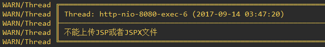

# Summer 使用文档

Summer是典型的MVC结构(Summer没有提供View，可以直接使用JSP或者其它模板引擎)，其Controller与Model与其它MVC框架中的概念没有太大区别。同时Summer支持AOP(面向切面编程)，具体内容参见下面的Interceptor(拦截器)和Form(数据校验)

> 项目依旧处于开发设计阶段，很多地方在未来可能会变化很大

## 创建一个JavaWeb项目
首先，需要建一个标准的JavaWeb项目，建议使用Maven管理项目

## SummerConfig(Summer配置)
SummerConfig是Summer框架中非常核心的内容，它的本质是一个过滤器。它负责Summer各个组件的初始化，当接受到一个新的请求时，SummerConfig会查找路由表，将这个请求交给相应的Controller的方法处理，从这个角度来看，其功能和Spring中的DispatcherServlet很相似

编写一个自己的Config并且继承自SummerConfig，实现其抽象方法。下面是SummerConfig的所有抽象方法
```java
public class SummerDemoConfig extends SummerConfig {
    public void initConstant(ConstantConfig config) {} // 配置系统常量
    public void initRoute(RouteConfig config) {}       // 配置路由表
    public void initModel(ModelConfig config) {}       // 配置数据库
    public void initPlugin(PluginConfig config) {}     // 配置插件
}
```

修改web.xml
```xml
<filter>
    <filter-name>MyWeb</filter-name>
    <filter-class>space.wangjiang.test.SummerDemoConfig</filter-class>
</filter>
<filter-mapping>
    <filter-name>MyWeb</filter-name>
    <!--"/*"表示拦截所有的请求 -->
    <url-pattern>/*</url-pattern>
</filter-mapping>
```

> 请注意，为了表述方便，有时候直接说**在SummerConfig中配置XXX**，其意思指的是在你自己的Config中配置，其它还有在**Controller中配置XXX**也是一样。如有表述不清晰的地方，请联系上下文理解

### SummerConfig的调用顺序
SummerConfig在启动时的调用顺序是：initConstant --> initRoute --> initModel --> initPlugin

### loadPropFile(String fileName)
这个是SummerConfig提供的方法，可以用来加载properties配置文件，建议在```initConstant(ConstantConfig config)```方法下面调用这个方法，因为SummerConfig的最先调用该方法，这样可以保证其他方法可以正常获取配置的参数

### initConstant(ConstantConfig config)(常量配置)
在```initConstant(ConstantConfig config)```中你可以去配置一些常量，比如自定义404页面、设置页面编码等等

#### setDevMode(boolean devMode)
这个方法是是否开启开发者模式，在开发者模式下面，你能看到完整的请求数据，调用哪一个Controller的方法，以及请求执行的时间等等

#### setShowRoutes(boolean showRoutes)
是否显示路由表，默认关闭，当开启之后，Summer在启动的时候会将所有的路由表映射规则打印出来
<div align="center">
	
</div>

#### setEncoding(String encoding)
设置所有request和response的编码，默认是UTF-8编码

#### setErrorPage(Integer code, String path)
```setErrorPage(Integer code, String path)```是配置HTTP状态码对应的页面，比如```config.setErrorPage(404, "/404.jsp");```表明当发生404请求的时候，返回/404.jsp页面的内容

为了便于使用，Summer提供了```setPage404(String page404)```、```setPage500(String page500)```等方法

#### setStartLogo
Summer在启动的时候，默认会输出Summer的startLogo，如下图。你可以调用setStartLogo(String startLogo)，自定义你自己的启动内容
<div align="center">
	
</div>

### initRoute(RouteConfig config)(配置路由)
这个是用用来配置路由表的，Summer中的路由是指一个URL到方法的映射(即该URL的请求由该方法处理)

#### 如何建立URL映射
例如```config.addRoute("/user", UserController.class)```表示UserController负责/user下的请求，当访问/user/edit的时候，这个请求将会交给UserController里的edit()方法。如果你熟悉JFinal的话，你会发现这个和JFinal几乎是一样的

#### 默认的路由规则
如果配置了```config.addRoute("/blog", BlogController.class)```，那么Summer将会自动增加如下路由规则
```java
/blog  ---> BlogController.index()
/blog/ ---> BlogController.index()
```
当然，如果你的BlogController没有index()这个方法，上面的路由就不会被创建

同时，如果在index方法上面增加了@UrlMapping注解，上面的规则将不会存在，@UrlMapping的使用可以参见下面的Controller的相关文档

> 可以在```initConstant(ConstantConfig config)```配置显示路由表```config.setShowRoutes(true)```，这样在Summer启动时，会打印所有的路由表

### initModel(ModelConfig config)(配置数据库)
配置数据库信息以及建立数据库表与Model的映射关系。如下所示，将Blog与数据库中的blog表建立关联，并声明其主键是id
```java
config.addMapping("blog", "id", Blog.class);
```

详细的内容参见下面有关Model的文档

### initPlugin(PluginConfig config)(配置插件)
Summer提供了插件机制，用于扩展Summer的功能，详细的内容参见下面关于Plugin的文档

## Controller(控制器)
和其他的Web项目一样，Controller用于处理HTTP请求。需要注意的是，Summer中Controller并不是单例的，而是每次请求实例化一个新的Controller，这点和JavaWeb的Servlet完全不同，Servlet是单例的，因此Summer的Controller是线程安全的

### URL与方法的映射规则
```java
public class SimpleController extends Controller {
    public void test() {
        renderText("test");
    }
}
```

上面的SimpleController在Config中如下配置
```java
 @Override
public void initRoute(RouteConfig config) {
    config.addRoute("/simple", SimpleController.class);
}
```

因此，当访问/simple/test的时候，就会调用SimpleController.test()方法，此时浏览器会显示"test"这句话

> Summer的基础路由没有JFinal那么多花样，只有这个功能，JFinal还有/simple/test/1-20用法，1和20会当做参数传给SimpleController.test()。Summer没有这种用法，因为它有@UrlMapping

### @UrlMapping
@UrlMapping是Summer的一个重要功能，它类似于Spring的@RequestMapping。@UrlMapping主要是为了增强Summer的路由设计，可以用它实现参数路由、URL重写等常见功能

#### 在URL路径中包含参数
在Web开发中经常会设计这样的URL，/blog/72/edit，表明编辑id为72的文章

在Summer中你可以很轻松实现这个功能，只需要在方法上加上@UrlMapping(url = "/blog/{blogId}/edit")这个注解就可以了，然后就可以在方法中调用```getPathPara("blogId")```就可以获取到blogId的值

#### URL重写
为了SEO，可能我们需要重写URL，例如将/blog/view?blogId=123重写成/blog/123.html，在Summer中，可以利用UrlMapping轻松实现，在相应的方法上加上@UrlMapping(url = "/blog/{blogId}.html")就实现了这种效果。在JFinal中可能你还需要Handler去实现这个功能，Summer灵活的路由表可以实现很多有意思的功能

@UrlMapping不是一定要在URL中加入参数的，也可以直接用于改写URL，比如有一个getUserInfo()的方法，默认访问/getUserInfo，但是我们不希望使用驼峰路径，就可以加上@UrlMapping(url = "/get_user_info")，它会覆盖原来的路由

#### @UrlMapping的一些注意事项
@UrlMapping会覆盖掉原来的URL，例如下面的代码，当试图去访问/blog/view的时候，Summer会找不到这个路由而显示404
```java
@UrlMapping(url = "/blog/{blogId}.html")
public void view() {
    String blogId = getPathPara("blogId");
    //.......
}
```

在**默认的路由规则**那里也说了，@UrlMapping注解是用在index方法上面，会影响默认路由的创建，这个需要格外注意

Summer不会优先匹配@UrlMapping中的带有路径参数的URL，如下面的代码，当访问/blog/delete的时候，Summer会调用delete()方法，如果没有delete()方法，才会把"delete"当做一个blogId传递给view()方法
```java
//控制器绑定 /blog
@UrlMapping(url = "/blog/{blogId}")
public void view() {
    //.......
}

public void delete() {
    //......
}
```

简单地说，Summer的路由有两种，一种是精准匹配的，例如/user/settings，/blog/view，另外一种是带有路径参数的URL，如/user/{userId}，/blog/{blogId}.html，当请求一个URL的时候，Summer会优先查找精准匹配的路由表，如果没有找到，才会去查找带路径参数路由表

**@UrlMapping可能会导致路由表和预想的不一样** 比如下面两个路由，当试图访问/user/42.html的时候，我们希望的是访问前一个，但是实际访问的路由可能是后者
```txt
/user/{blogId}.html
/{userName}/{blogId}.html
```

这是因为两个路由都是匹配这个url，Summer查找参数路由表，如果发现匹配会直接返回，不会再去匹配余下的路由。因此，当你使用@UrlMapping的时候，应当注意此类特殊情况

### 与JFinal的不同
Summer的路由设计受JFinal的影响很大，但是增加了一些自己的特色用法，如果你熟悉JFinal的路由设计，下面的内容需要你注意一下差异

Summer并不像JFinal一样把URL的最后一截当做参数，例如/blog/23，在JFinal中可以通过getPara(0)获取23这个值。JFinal因为这个特性，当你试图访问一个不存在的URL，例如/user/test，如果控制器里面没有test()方法，它会把test当做一个参数，去访问控制器的index()方法

Summer中没有这种用法，当访问/user/test的时候，如有没有test()也没有@UrlMapping(url = "/user/{userId}")，那么，Summer将会直接找不到路由，显示404，而不是把test当做一个参数，把请求交给index()方法，因为Summer根本就不支持getPara(0)这种用法

JFinal中有/user/12-363这种用法，可以通过getPara(0)、getPara(1)获取相应的值，如果你也希望做出这种效果，可以用@UrlMapping(url = "/user/{userId}-{blogId}")来实现相同的功能

### 与Spring的不同
Summer中的@UrlMapping与Spring中的@RequestMapping很相似，但是需要注意，Summer的路由是不包括请求方式的，只有URL，这也是为什么叫UrlMapping的原因

### 为什么Summer的路由会这么设计
大多数Web框架都是支持正则路由的，不过形式有所区别，Django的路由就完全是正则表达式，Spring的则是参数式路由。但是JFinal却不支持/user/36/blog/126这种形式的路由(当然你可以用Handler实现)，至于为什么这样，很容易理解，为了性能。路由是Web框架调用最频繁的功能，虽然查找路由速度对页面响应时间的影响可以忽略不计，但毕竟是一个频繁到不能再频繁的功能，自然是越快越好

正则路由(或者说参数路由)是一个相当常见的功能，Summer并不准备为了性能放弃这个功能。为了加快路由查找的速度，Summer将路由分为两种，当一个URL传进来的时候，先在精准路由表中查找，因为是一个Map，所以效率是O(1)，如果查不到，才会到参数路由表中，依次正则匹配。所以，Summer的路由查找效率也是很高的

**注意** 如果web.xml配置的是所有请求都经过Summer，这时候，你需要意识到一个严重的问题，所有的静态资源文件(css、js等等)也会去查找路由，它们不在精准路由表里面，然后接着去查参数路由表，最后这些资源请求会交给Tomcat等服务器处理。当然，在实际情况，一般静态文件都是由Nginx或者Apache之类的HTTP服务器处理，到Summer的基本上都是Action请求，所以问题似乎也不大

## Controller的其他方法
Controller的方法命名都相当语义化，大多都是对request和response进行封装，便于使用，getPara()获取request的Parameter参数，getAttr()获取request的Attribute参数，getPathPara()获取URL路径的参数

不过需要注意一下getPathPara()，查看源码可以看出，这个本质上是获取Attribute，之所以这样，是因为获取URL的路径参数之后，没有办法放到Parameter的，request没有提供setParameter()方法(应该是为了防止数据被篡改污染)，因此直接放到Attribute里面，并在Controller中提供了一个getPathPara()方法，因此，会覆盖掉Attribute里同名的值，需要额外注意

### render系列方法
render的核心是设置response的ContentType
* renderText(String content) 将内容作为文本输出给客户端
* renderJsp(String jspPath) 渲染JSP
* renderHtml(String html) 将内容作为html输出，注意其参数是html内容本身，不是html文件的位置
* renderJson(String json) 将内容作为JSON输出
* renderJson(Object object) 将对象序列化为JSON字符串输出
* renderImg(File imgFile) 将文件作为图片输出
* renderFile(File file) 输出文件，一般情况浏览器会直接下载该文件

### Cookie相关操作
* ```getCookie(String name)```获取cookie的值
* ```getCookie(String name, String defaultValue)```获取cookie的值，如果没有则返回默认值
* ```setCookie(String name, String value, int maxAge, String path, String domain, boolean httpOnly)```setCookie()系列方法最终均是调用该方法
* ```removeCookie(String name)```移除指定name的cookie

### File相关操作
主要包括上传文件和下载文件两类方法
* ```getFiles()```获取上传的文件列表，```getFile()```系列方法最终均是调用该方法，上传的文件会自动保存到/upload目录下，如果存在重名文件，Summer会自动给文件重命名(在文件名后面追加1、2、3...)
* ```renderFile(File file)```下载文件

在上传文件的时候，需要注意如果请求为multipart(form表单使用了```enctype="multipart/form-data"```)，必须先调用```getFile()```系列方法才能使```getPara()```系列方法正常工作(否则将全部获取null)，因为multipart请求需要通过```getFiles()```解析请求，具体内容可以参见```UploadRequestWrapper```

为了安全考虑，Summer禁止上传JSP或者JSPX文件，当试图上传这类文件时，Summer会报出警告，并直接删除这些文件。如果需要上传此类文件，需要自己实现，或者上传前修改文件后缀，上传完成之后再修改回来
<div align="center">
	
</div>

## Route(路由)
> 这个内容是对上面的Controller的一个补充，在Summer中，Route是一个URL到Method的一个映射

### 什么样的方法会被认为是Route
Controller类中公有的(public)、无返回值(void)、无参数、不是静态的(static)，并且没有标记@NotRoute的方法，这些方法会被认为是路由，在Summer中称它们叫路由方法

### 忽视某些路由方法
如果你在Controller写了一个公有的无返回值无参数的方法，但是你不希望它被当做Route。你可以在这个方法上加上@NotRoute注解，这样Summer就会忽略这个路由方法，不会加入路由表

例如在Controller源码中，render404()是Controller提供的一个方法，本身是封装便于使用，但是它是一个公有的无返回值，无参数的方法，如果不加上@NotRoute注解，路由表中会增加各种/.../render404路由，这显然不是我们想要的结果
```java
@NotRoute
public void render404() {
    renderError(404);
}
```

你可以设置```config.setShowRoutes(true)```，在Summer启动时查看路由表

## REST(呈现状态转移:REpresentational State Transfer)
> 这个内容也是是对Controller的一个补充，在这里，我们并不细细讨论到底什么是[REST](https://en.wikipedia.org/wiki/Rest)，我们简单认为REST是使用不同的HTTP动词，表示对资源的相应操作，比如GET /blog/42，表示获取id为42的博客内容，DELETE /blog/42则表明删除id为42的博客，即HTTP四个动词(POST、GET、PUT、DELETE)表示数据库的相应操作(CRUD)

### RESTfulController
Summer本身并不支持REST的，Summer的路由表的设计不是RESTful的风格，Summer中路由并不包括请求方式，例如GET /user/index和DELETE /user/index都是由UserController.index()方法处理。但是你如果要设计RESTful的API，可以利用RESTfulController实现

将你的Controller继承自RESTfulController，然后，实现四个抽象方法(get、post、put、delete)。RESTfulController的原理很简单，就是在index方法中判断request的请求方式，然后内部转发给相应的方法执行

### RESTful的注意事项
对于RESTful到底好不好的讨论已经很多了，这里就不再评论了，但是需要注意有的服务器默认是不允许PUT、DELETE之类的请求，需要手动设置

## Interceptor(拦截器)
拦截器(在Django中称为中间件)在Web开发中不可缺少的内容，也是AOP(面向切面编程)的重要内容，Summer的拦截器设计是相当简洁的

创建一个自己的拦截器类，然后实现Summer的Interceptor接口。如下，创建了一个登陆拦截器，没有登陆的用户请求都会被拦截
```java
public class LoginInterceptor implements Interceptor {
    @Override
    public boolean handle(Bundle bundle) {
        User user = bundle.getController().getSessionAttr("user");
        if (user == null) {
            bundle.getController().redirect("/login");
            return false;
        }
        return true;
    }
}
```

可以看出，当拦截器的handle返回true的时候，表示请求通过了，返回false则表明请求被拦截，后面的拦截器和控制器都不会被调用，你可以直接在response中输出你要返回给客户端的内容或者跳转到指定页面

> 其中Bundle是一些数据的封装，它里面封装了Controller的实例，要执行的Method和请求的url

### 如何激发拦截器的拦截功能
在Controller的需要拦截的Method或Class上加上```@Before()```注解。如下，表明只有GET请求并且用户已经登录系统才可以访问
```java
@Before({GET.class, LoginInterceptor.class})
public void view() {
   //......
}
```

> 其中GET、POST这些是Summer内置的拦截器

有时候可能会出现，某个Controller的大部分方法都是GET请求的，但是有一两个是POST请求的，这时候你可以在类上标记GET拦截器，然后再不需要GET的路由方法上面使用```@Remove({GET.class})```注解，具体参加下面的Remove注解

### Remove(移除拦截器)
Remove注解用于移除路由方法上面的拦截器，不过你需要注意的是Summer对拦截器的处理，和Remove、Before这两个注解的实际排列顺序是有关的，比如下面的情况
```java
@Remove(GET.class)
@Before(GET.class)
public void view() {
    //....
}
```

Summer会先移除GET注解，然后再加上(当然一般也不会这么写)，如果你把这两个顺序写反，则是先加上GET拦截器，再移除。@Remove中如果没有写具体要移除的拦截器，则表明移除全部的拦截器

### GET和POST拦截器
GET和POST拦截器是Summer内置的拦截器，用于表示路由方法只接受GET或者POST请求

**注意** 如果一个路由方法上同时有GET和POST拦截器(也不应该这样做)，这个表示的并不是同时允许GET和POST请求，而是哪一个最先配置，就只允许那一类请求

### GET和POST拦截器的补充说明
Summer将GET和POST仅仅当做拦截器，这个和Summer的设计有关，Summer本身并不是一个RESTful的框架，Summer的路由仅包括请求路径并不包括请求方式

### Interceptor的线程安全问题
和Controller每次请求就实例化一个对象不同，Interceptor对象是在Summer初始化的时候生成的，是单例的，因此它可能会导致出现线程安全的问题，如果你对线程安全并不了解，建议了解一下

什么时候会出现线程安全的问题，如果拦截器存在成员变量，需要格外注意，像下面的代码，每请求一次，count的值都会+1，也就是说它不是线程安全的
```java
public class MyInterceptor implements Interceptor {
    private int count = 0;

    @Override
    public boolean handle(Bundle bundle) {
        count++;
        EasyLogger.debug("MyInterceptor count=" + count);
        return true;
    }
}
````

也就是说只要handle()方法内部没有成员变量的操作，Interceptor就是线程安全的。至于为什么设计成这样，自然是出于性能考虑的，一个路由方法上可能会有很多拦截器，如果每次都通过反射生成实例，也是很消耗资源的

在Summer中，Interceptor的实例的由InterceptorManager负责管理，它内部维持了一个Interceptor池，你可以通过调用```InterceptorManager.getInstance(Class<? extends Interceptor> clazz)```获取拦截器实例，并不建议自己去new一个Interceptor对象，当然你也不需要这么做

## Form(表单验证)
作为Web框架，表单验证是一个相当重要的内容，它可以简化Controller的代码，把代码负担到其他的类。它同Interceptor一样，也是SummerAOP的一部分

### 使用
Summer的表单验证非常简单，创建一个表单类，如RegisterForm，继承Form类，然后创建需要的字段，加上各种所需要的注解，并配置合适的参数，如下
```java
public class RegisterForm extends Form {

    @Required
    @Length(max = 12, errorMsg = "用户名不能超过12字符")
    private String username;

    @Required
    @Type(type = Type.TYPE.EMAIL, errorMsg = "邮箱错误")
    private String email;

    @Type(type = Type.TYPE.NUMBER, errorMsg = "输入有效的数字")
    private String age;

    @Required
    @Length(min = 3, max = 16, errorMsg = "密码长度错误")
    private String password;

    //getter方法省略
}
```

上面的RegisterForm创建了一个注册时需要填写的表单，Form的字段名就是表单的字段名，errorMsg是校验失败时输出的错误消息，由RegisterForm可以得知，需要提交的参数有
* username:必填，且长度不得超过12字符
* email:必填，且格式必须要是合法的email
* age:非必填，且必须是有效的数字
* password:必填，且长度在3到16个字符之间

### 表单支持的注解
* Required:是否是必填的
* Type:参数的类型，可选TEXT、NUMBER、TEL、EMAIL、URL，默认是TEXT
* Length:长度，支持最小(默认0)和最大(默认Integer.MAX_VALUE)长度两个属性
* In:表示值只能某几个类型之中，例如性别只能是"男"、"女"或者"保密"，@In(in="男,女,保密")
* Regex:内容是否匹配该正则表达式

需要注意的是，上面的注解都是在String的基础上进行判断的。关于Required需要注意，空字符串是被认为是有值的，比如URL是```?age=&name=abc```，那么Summer会认为age有值，并开始校验该值是否是一个合法的数字

### 不建议Form中出现非String类型的字段
虽然Summer支持原始类型以及对应的封装类字段，但是因为所有的校验注解都是基于String的，原始类型的字段可能会导致校验结果和预期的不同，例如上面的age如果是int类型，在实例化Form之后，初始化为0，显然是一个有效的数字，所以即便表单没有age字段，age也会认为是有值的。关于这个问题，Summer在未来可能会移除掉对非String字段的支持

### 如何激发表单的验证
1、你可以在Controller的方法中调用```getForm(RegisterForm.class)```，它会自动实例化一个RegisterForm，然后调用```isValid()```验证表单，验证失败会返回false，同时可以调用```getErrorMsg()```获取错误信息，如下
```java
LoginForm form = getForm(LoginForm.class);
if (!form.isValid()) {
    renderText(form.getErrorMsg());
    return;
}
```

2、觉得上面的有点繁琐，你也可以直接使用@CheckForm()注解，当验证失败之后，会自动将错误信息输出浏览器，验证成功后，可以调用```getForm()```获取表单
```java
@CheckForm(RegisterForm.class)
public void registerAction() {
    RegisterForm form = getForm();
    //......
}
```

不过需要注意，@CheckForm()在验证成功之后，会将Form对象放到request的Attribute中，name是**this_form_is_set_by_check_form_annotation**，你可以查看Form源码中的ATTRIBUTE_FORM_NAME，```getForm()```的本质是```request.getAttribute(Form.ATTRIBUTE_FORM_NAME)```

```getForm()```一定要和```@CheckForm()```搭配使用的，不要和```getForm(Form.class)```这个方法混淆。如果没有在方法上标记```@CheckForm()```，直接调用```getForm()```，在开发模式下你会看到如下错误信息
<div align="center">
	
</div>

### 请求中包含文件
如果请求中包含文件(multipart类型的表单)，请注意，此时请求是二进制的，必须先解析才可以正常校验表单，否则值全部为null，具体内容可以参见上面Controller中的**File相关操作**的相关内容。下面两种方式都可以

1、先调用```getFile()```解析请求，然后调用```getForm(MyForm.class)```获取表单对象，正常校验判断

2、在拦截器上面使用AnalyzeFile拦截器，它会解析请求，这样就可以正常使用@CheckForm()了

### @CheckForm()自定义输出格式
@CheckForm()注解验证表单失败之后，默认会将errorMsg当做文本直接输出。显然，绝大多数情况我们需要自定义输出的格式，或者校验失败后显示或跳转到指定的页面

Form提供了一个```renderError(Controller controller, String errorMsg)```方法，你可以直接复写该方法，实现自己的输出格式，如下所示:
```java
@Override
public void renderError(Controller controller, String errorMsg) {
    controller.renderJson("{\"errorMsg\":\"" + errorMsg + "\"}");
}
```

### 关于表单验证的设计
实际上表单验证早期根本就不是这么设计的，原先是一个Field注解，可选填type、minLength、maxLength等等，这样的好处是不需要在字段上标记一大堆注解，但是缺点也很明显，一个字段只能有一个errorMsg，不管是长度不符合或者是否是必填，errorMsg通通一样，实用性不强。实际的使用效果如下:
```java
public class RegisterForm extends Form {
    @Field(type = EMAIL, errorMsg = "邮箱地址错误")
    public String email;

    @Field(minLength = 3, maxLength = 16, errorMsg = "密码长度错误")
    public String password;
}
```

经过一段时间的使用之后发现，这种设计确实不好用，于是改为像Spring那种分解为各种小的条件

## Model(模型)
Model是一个相当重要的内容，它提供了操作数据库的功能

Summer的Model受JFinal影响非常大，我个人很喜欢直接写SQL，简单粗暴，像Django那样的ORM框架设计，感觉手脚被绑住一样，JPA虽然是很赞的设计，但是面对复杂查询，表现不是很理想

目前Summer的数据库还是相当简陋
* 不支持事务操作
* 不支持缓存

### ModelConfig
在使用Model功能之前，需要配置数据库的JDBC驱动、JDBCUrl、用户名和密码，在你的Config类中的```initModel()```方法中添加类似于如下内容(还需要在pom.xml中引入相应的JDBC驱动)
```java
@Override
public void initModel(ModelConfig config) {
    config.init("com.mysql.jdbc.Driver",
            "jdbc:mysql://127.0.0.1:3306/summer?characterEncoding=utf8&useSSL=false",
            "root",
            "123456");
}
```

之后你需要创建自己的Model类，继承自Summer的Model，如下
```java
public class User extends Model<User> {

}
```

没错，不需要写任何内容

在创建完Model类之后，需要配置Model与数据库的映射，在你的Config类中的```initModel()```方法中添加映射
```java
@Override
public void initModel(ModelConfig config) {
    //......
    config.addMapping("user", "id", User.class);
}
```

第一个参数是表名，第二个是主键，第三个是你的Model类

### ConnectionProvider(数据库连接提供器)
ConnectionProvider是一个接口，主要是给Model提供Connection，你可以使用数据库连接池(参见DruidConnectionProvider，基于阿里的Druid数据库连接池)，或者直接```DriverManager.getConnection(url, username, password)```来手动获取连接(参见DefaultConnectionProvider，Summer默认使用这个)。如下，在SummerConfig配置
```java
@Override
public void initModel(ModelConfig config) {
    //...
    config.setConnectionProvider(new DruidConnectionProvider());
}
```

当然你也可以不设置，Summer会直接使用DefaultConnectionProvider，但是注意，默认连接提供器每次都会创建一个新的连接，因此会比较耗时

### 复合主键(联合主键)
Summer支持复合主键，配置很简单，不过需要注意，主键的顺序很重要，需要和数据库的实际顺序相同
```java
config.addMapping("like", "blog_id,user_id", Like.class);
```

然后就可以像使用普通的主键一样去使用
```java
Like like = Like.DAO.findById(1, 2);
```

### find()查找记录
Model支持如下查询功能
* findById(id)通过主键查询
* find(sql, Object... params)来查询列表，后面的是SQL的参数
* findFirst(sql)找到第一条记录

简单说一下SQL参数的问题，为了抵御SQL注入攻击，Summer的底层使用的是PreparedStatement，比如你本来想查询的SQL是```"SELECT * FROM user WHERE name='" + name + "';"```，name是一个参数，那么你可以这么写，```find("SELECT * FROM user WHERE name=?", name)```，更多内容可以参见PreparedStatement的使用

需要注意
* find(sql)没有查询到的时候，返回的是一个空的List，并不是null
* findFirst(sql)本质是调用find(sql)，然后取结果的第一条，因此，建议在sql语句后面加上```limit 1```之类的限制语句

### save()保存一条记录
你需要new一个Model，填充数据之后，调用save()保存到数据库，如下示例，将插入一条新的User记录
```java
User user = new User();
user.set("name", "Jack");
//......
user.save();
```

### update()修改记录
当你需要修改数据时，你只需要填充需要修改的内容，然后调用edit()保存到数据库，如下示例，将ID为1的用户名修改为Tom
```java
User user = new User();
user.set("id", 1);
user.set("name", "Tom");
user.update();
```

需要注意，你需要保证你的Model对象中一定要存在主键，否则在调用update()的时候会抛出异常"主键不能为空"

上面的那种通过手动设置id似乎不多见，更多的时候，可能是像下面这种用法
```java
User user = DAO.findById(1);
user.set("name", "Tom");
user.update();
```

### delete()删除记录
删除一条记录，可以像下面这样
```java
User user = DAO.findById(1);
user.delete();
```

或者直接调用```deleteById(id)```删除指定id的记录

### page()分页
分页的方法```Page page(int pageSize, int pageNumber, String select, String where, Object... params)```，第一个参数是每页的数目，第二个是获取第几页的内容，注意计数是从1开始的，第三个是SELECT语句部分，第四个是WHERE条件部分，第五个则是SQL的参数(参见find())，返回的Page对象，封装了一些可能会用到的数据(是否是第一页，最后一页，总页数等等)，你可以调用```getData()```获取查询到的列表

需要说明一下第三、四个参数，假如查询语句是```SELECT id,title FROM blog WHERE user_id=10```，每页10条记录，获取第一页，那么应该这么调用```page(10, 1, "SELECT id,title", "FROM blog WHERE user_id=10")```

为什么会设计成这样子，主要是为了方便获取符合条件的总行数，你可以参考Model分页的相关代码

### ModelGenerator(Model类生成工具)
Summer的Model存取值都是类似于```getInt("blog_id")```这种操作，你可以觉得这设计简直是反人类，如果数据库的字段变了，那岂不是要一个个改代码，而且IDE的提示功能也没有了

为了解决这个办法，Summer给出的建议是编写ModelBean类，封装Model的getter和setter方法。当然这种纯体力的劳动，没必要我们亲自去做，Summer引入了**ModelGenerator**这个类，你只需要简单配置，然后它就可以根据数据库的表结构自动生成ModelBean、Model和MappingKit，下面是具体的的使用方式
```java
public void generator() throws Exception {
    ConnectionProvider provider = new DefaultConnectionProvider();
    provider.init("com.mysql.jdbc.Driver",
            "jdbc:mysql://127.0.0.1:3306/summer?characterEncoding=utf8&useSSL=false",
            "root",
            "123456");
    String modelPath = "D:/workspace/Summer/src/test/java/space/wangjiang/summer/test/model/";
    String modelPackage = "space.wangjiang.summer.test.model";

    ModelGenerator generator = new ModelGenerator();
    generator.setConnectionProvider(provider);
    generator.setModelPath(modelPath);
    generator.setModelBeanPath(modelPath + "bean");
    generator.setModelPackage(modelPackage);
    generator.setModelBeanPackage(modelPackage + ".bean");

    generator.generate();
}
```

> 上面的setModelBeanPackage()和setModelBeanPath()是可以省略的，默认Bean的包名是modelPackage + ".bean"，默认路径是modelPath + "bean"

生成的ModelBean类
```java
public abstract class BlogBean<M extends BlogBean<M>> extends Model<M> {

    public void setId(java.lang.Integer id) {
        set("id", id);
    }

    public java.lang.Integer getId() {
        return (java.lang.Integer) get("id");
    }
    //....其它省略
}
```

生成的Model类
```java
public class Blog extends BlogBean<Blog> {
    public static final Blog DAO = new Blog();
}
```

生成的MappingKt
```java
public class MappingKit {

    public static void mapping(ModelConfig config) {
        config.addMapping("blog", "id", Blog.class);
        //其他省略
    }
}
```

然后就可以愉快地在代码中使用getter和setter了

**注意** 因为JDBC的问题，ModelGenerator生成的MappingKit，复合主键的字段顺序可能是错误的，例如，实际上是"user_id,blog_id"，但是生成可能是"blog_id,user_id"，因此建议使用```MappingKit.mapping(config);```之后，重新覆盖一下复合主键的记录，防止出错

### java.lang.ClassCastException(类型转换错误)
这种错误常常出现在当我们不清楚字段的具体类型，而试图将它强制转换成为其他类型的时候，比如下面的语句，```count(*)```实际上是Long类型的，但是却试图将它转换成Integer类型
```java
User user = User.DAO.findFirst("select count(*) from user");
print("count:" + (Integer) user.get("count(*)"));

//错误:java.lang.ClassCastException: java.lang.Long cannot be cast to java.lang.Integer
```

这种错误常常在获取count()、sum()等等的时候出现，很烦人，为了解决这种问题，Model的getInt等方法先将对象转化为Number类型，再获取相应的intValue()、longValue()等等

### Dialect(SQL方言)
因为不同的数据库对SQL的支持并不相同，为了兼容不同的SQL语法，Summer使用Dialect(方言)这一概念。Summer内置了MySql(MySqlDialect)和Sqlite(SqliteDialect)的方言，为了方便扩展其它数据库，可以自己实现Dialect接口

Dialect有几个抽象方法需要实现
```java
public abstract String getAllTableNameSql();
public abstract String getTableMetaDataSql(String tableName);
public abstract String buildPageSql(String baseSql, long offset, int pageSize);
public abstract String buildSaveSql(ModelMapping mapping, Map<String, Object> attrs, List<Object> params);
public abstract String buildUpdateSql(ModelMapping mapping, Map<String, Object> attrs, List<Object> params);
public abstract String buildFindByIdSql(ModelMapping mapping);
public abstract String buildDeleteByIdSql(ModelMapping mapping);
```

### 关于方言的补充
其实不同数据库的语法差异在Summer中遇到的并不多，主要是对字段的转义(在MySql中是``，而在Sqlite中则是\[])，以及获取数据库中所有的表结构(这个不同数据库几乎就完全不同了)。

方言最初设计得非常简单，只有```getAllTableNameSql```方法和```wrapColumn(String column)```这两个方法，子类只需要实现这两个，基本的SQL语句是在Model内部拼接的，最初的效果还是很好的，很轻松地兼容了MySql和Sqlite，但是这种设计对数据库的扩展性就非常差，比如某个数据库的SQL语句必须小写(似乎没有这么特殊的情况)，那么Model的save()、update()等方法就完全失去作用了，因此把SQL语句的拼接交给了方言自己实现，既减少了Model的代码量，还可以任意兼容数据库

### 在非Web环境下使用Model功能
很多时候，我们需要在非Web环境下使用数据库功能，比如写了一个爬虫程序，需要在运行时保存数据到数据库。在早期的Summer中，没有专门对非Web环境下使用Model做支持，因此使用起来还是很繁琐的，你需要如下配置，主要是需要实例化一个SummerConfig
```java
private static SummerConfig summerConfig = new SummerConfig() {
    @Override
    public void initConstant(ConstantConfig config) {}

    @Override
    public void initRoute(RouteConfig config) {}

    @Override
    public void initModel(ModelConfig config) {
        config.init("com.mysql.jdbc.Driver",
                "jdbc:mysql://127.0.0.1:3306/summer?characterEncoding=utf8&useSSL=false",
                "root",
                "123456");
        config.addMapping("blog", "id", Blog.class);
        config.addMapping("user", "id", User.class);
    }

    @Override
    public void initPlugin(PluginConfig config) {}
};

static {
    SummerConfig.config = summerConfig;
    summerConfig.initModel(summerConfig.getModelConfig());
}
```

虽然看起来需要实现的东西并不多，但是这种解决方案称不上简单优雅，为了简化在非Web环境下使用Model，Summer专门对Model内部的代码做了调整，现在的配置看起来更符合直觉，也更简单
```java
ModelConfig config = new ModelConfig();
config.init("com.mysql.jdbc.Driver",
        "jdbc:mysql://127.0.0.1:3306/summer?characterEncoding=utf8&useSSL=false",
        "root",
        "123456");
config.addMapping("blog", "id", Blog.class);
config.addMapping("user", "id", User.class);
```

> 当然，即便Summer支持了更简单的非Web环境下使用Model，你依旧可以使用原先的方式

### 关于ModelConfig的注意事项
在Web环境下，不要去new一个ModelConfig，因为这毫无必要，Summer中的ModelConfig是由Summer在初始化的时候自动实例的，手动实例ModelConfig反倒是容易混淆

### 关于Model的一些补充
可能很多人不知道，SQL支持存在空格的字段名。说实话要不是偶然的机会，完全不会去查“SQL字段支不支持空格”这个问题的。但是觉得这个特性太诡异了，因此Summer不支持这个特性。当然这里的不支持，不是说完全就不能在Model中使用带有空格的字段，主要是带有空格的字段在ModelGenerator生成的代码是有问题的。其次主键是不能带有空格，因为在ModelConfig的```addMapping(String table, String primaryKey, Class<? extends Model> model)```，传入的primaryKey会被统一替换掉空格

**非常不建议使用带有空格的字段(无论是使用Summer还是其它框架)，Summer设计之初就没考虑这个问题，也没有任何的相关测试，可能会出现意想不到的问题**

## Plugin(插件)
Summer提供了插件接口(Plugin)，并提供了基本的生命周期start()和stop()，分别在Summer启动之后和停止之前调用

当你实现了自己的插件之后，需要在```initPlugin(PluginConfig config)```配置该插件，当Summer启动之后，将会依次启动插件
```java
@Override
public void initPlugin(PluginConfig config) {
    config.addPlugin(new TestPlugin());
}
```

### 发挥插件的作用
插件可以实现很多有意思的东西，比如Summer的路由需要在SummerConfig中统一配置，你可能会觉得这种方式很不友好，每创建一个新的Controller就得去SummerConfig中配置，能不能像SpringBoot的@Controller注解一样，框架自动去配置。Summer的插件完全可以做到这一点，只需要编写一个插件，在Summer启动时检索所有的类文件，判断是否是Controller，然后获取注解配置，加入到路由表，完全不需要在Config中一个个配置了，也不会出现忘记配置Controller，访问导致404了。

因为我实际使用的时候也觉得，总是要去SummerConfig中配置路由真的好烦，所以Summer内置了上面所说的插件(RouteMappingPlugin)，也内置了类扫描器(ClassScanner)，你可以把它当做一个参考，利用插件来实现更多有意思的功能。

### RouteMappingPlugin和@RouteMapping
这两个用于在Controller中直接配置路由，在SummerConfig中如下配置，RouteMappingPlugin接受的参数是你的项目的包名，它会加载该包下面所有的标记了@RouteMapping的Controller
```java
public void initPlugin(PluginConfig config) {
    config.addPlugin(new RouteMappingPlugin("com.myweb"));
}
```

在Controller上配置@RouteMapping(url="/test")，就将该Controller的路由绑定为/test

### ClassScanner(类扫描器)
上面的插件用到了ClassScanner，在这里简单说明一下。ClassScanner实际是使用的AbsClassScanner，这是一个抽象类，它有一个抽象方法accept(Class<?> clazz)，它的作用是对扫描到的类进行过滤，只获取符合条件的类。例如RouteMappingPlugin中就利用类扫描器，只获取标记@RouteMapping的Controller类
```java
AbsClassScanner scanner = new AbsClassScanner(basePackage) {
    @Override
    public boolean accept(Class<?> clazz) {
        return clazz.isAnnotationPresent(RouteMapping.class)
                && Controller.class.isAssignableFrom(clazz)
                && !Controller.class.equals(clazz);
    }
};
```

> 但是不要想着输入java，看看JRE的所有类，当你实际运行的时候会发现什么都没有。ClassScanner获取包下面的所有类是通过ClassLoader获取的，JRE的类是由BootstrapClassLoader负责加载到JVM的 ，应用类的加载是AppClassLoader负责的，因此你可以获取到项目依赖的第三方jar的类而不能获取JRE的，更多内容参见ClassLoader相关内容

## Lab(实验性功能)
Summer中有一个lab包，这个主要是一些实验性的功能

### SpiderInterceptor(爬虫拦截器)
Summer内置了一个简单的爬虫拦截器(SpiderInterceptor)，可以利用它为网站增加简单的反爬虫功能。如果IP访问频率超过单位时间的阈值，该IP会自动加入访问黑名单，禁止访问，超过一定时间后才会放行，允许正常访问，建议在```initConstant(ConstantConfig config)```配置
```
SpiderInterceptor.setErrorPage("/spider.jsp");//当判断IP是爬虫后的显示页面
SpiderInterceptor.setMaxPerSpan(60);//单位时间内最大访问次数
SpiderInterceptor.setCleanVisitIpSpanSeconds(600);//单位时间
SpiderInterceptor.setBlackListIpTimeOutSeconds(300);//禁止访问时间
SpiderInterceptor.setScanBlackListSpanSeconds(60);//每60秒检查黑名单内过期的IP
```

主要配置参数就这些，```setScanBlackListSpanSeconds```这个参数应当适当设置小一点，比如上面的配置，一个IP最长是300+60秒不能访问页面，当然，这不是什么大问题

需要注意的时，SpiderInterceptor不仅仅是一个Interceptor，它还是一个IPlugin(因为它内部的Timer需要启动和停止)，因此，除了配置需要做反爬虫的Method或者Controller类之外，还需要在```initPlugin(PluginConfig config)```中，添加这个插件，否则，拦截器将不起任何反爬虫作用
```java
config.addPlugin((IPlugin) InterceptorManager.getInstance(SpiderInterceptor.class));
```

> 实际上你也可以通过```config.addPlugin(new SpiderInterceptor());```来完成SpiderInterceptor的配置。如果你阅读过上面关于Interceptor的内容，可能会觉得奇怪，不是说Interceptor应该从InterceptorManager中获取吗，为什么这里又直接new了一个SpiderInterceptor。一般来说，使用InterceptorManager是Summer推荐的，但是SpiderInterceptor的内部的都是静态的变量，```config.addPlugin()```的目的是在Summer启动的时候，启动内部的Timer，以及当Summer停止的时候，停止Timer，因此这两种配置方式差别不大，不过还是推荐使用InterceptorManager，以免产生不必要的误解

### RouteMappingPlugin和@RouteMapping
参见上面的Plugin相关内容

## 依赖
Summer对于第三方库是持非常谨慎的态度，尽量使用由开源组织维护的主流库，并尽可能减少依赖。这些第三方库的使用可以参见他们的文档。此外，Summer还依赖了本人的其他项目，这些项目不可避免存在问题

### EasyLogger(<https://github.com/Wang-Jiang/EasyLogger>)
这是一个控制台输出库，它严格意义上不是日志库，因为它不会将这些信息写到文件中。它仅仅用于在控制台输出美观的信息

其中它提供了将对象转化成JSON的工具类JsonUtil，并且支持自定义JSON转化规则IJson。Summer中，Controller的renderJson()方法就是使用该类实现的，同时Summer的Model实现了IJson的toJson()方法

## 补充
这些内容是在日常开发中需要注意的

### 热更新
为了方便开发，大多数开发人员都会使用热更新插件，但是需要注意Summer的路由表是在Summer启动的时候创建的，因此当你的Controller增加了新的方法的时候，热更新之后，是无法访问到该方法的，需要重启服务器，才可以完成更新

### Jetty
Jetty是一个嵌入式服务器，可以去官网查看更多内容，使用Summer搭建的Web项目，Jetty的使用和普通Web项目没有差别。Summer的test代码就使用了Jetty，你可以参见MainServer

### 最低Java版本
Summer的最低Java版本是8，实际上Summer并没有使用太多Java 8的语法，但是依旧将最低版本设为8。Java 8是14年发布的，现在(18年4月)Java已经发布10了，Summer也并非所谓企业级解决方案，没有必要去兼容Java 7甚至6了

## 最后
当你阅读Summer的源码会发现，Summer大量使用了反射，查找路由使用正则去匹配，这些东西都是会消耗资源的。从某种程度上来说，框架就是消耗资源去提升开发的效率。不过框架带来的便利性，开发效率的提升，这种消耗还是很值得的

我用过Spring、JFinal、Django等等，就我实际的使用情况，最喜欢JFinal的设计。因此这个项目受到了JFinal的极大的影响，比如Controller的方法命名基本上都是兼容JFinal的，Model的基本功能和JFinal没有太大区别(因此JFinal项目可以比较轻松地移植到Summer上面)，甚至ModelBean的解决方案也是从JFinal的BaseModel启发来的

Summer作为一个框架，还是相当不成熟的。我在使用Summer搭建Web的时候，会根据自己的实际体验，修改我觉得不好用的地方，增加我希望的功能，不断地完善它